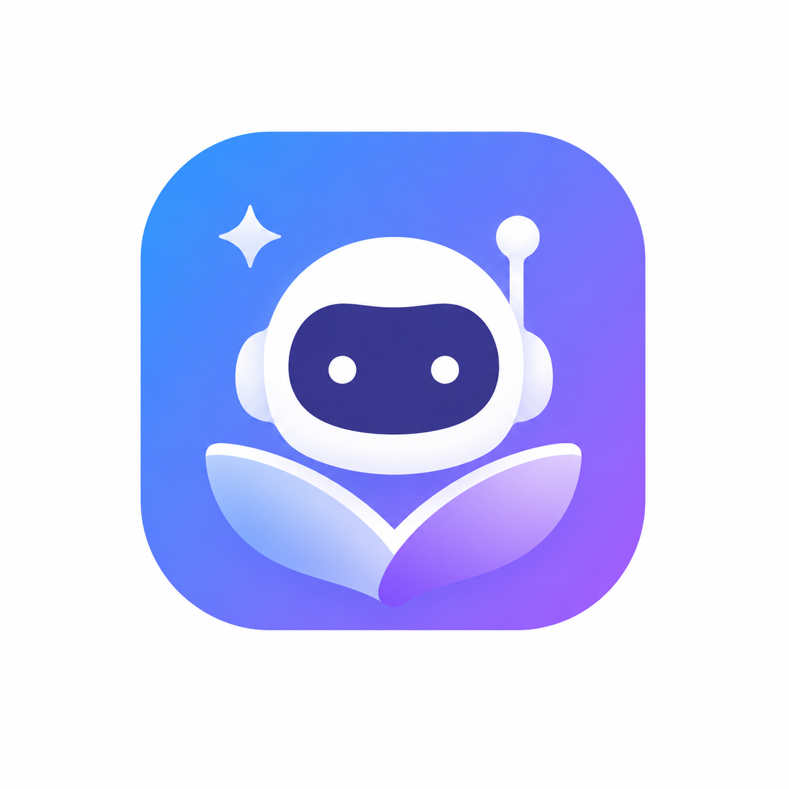
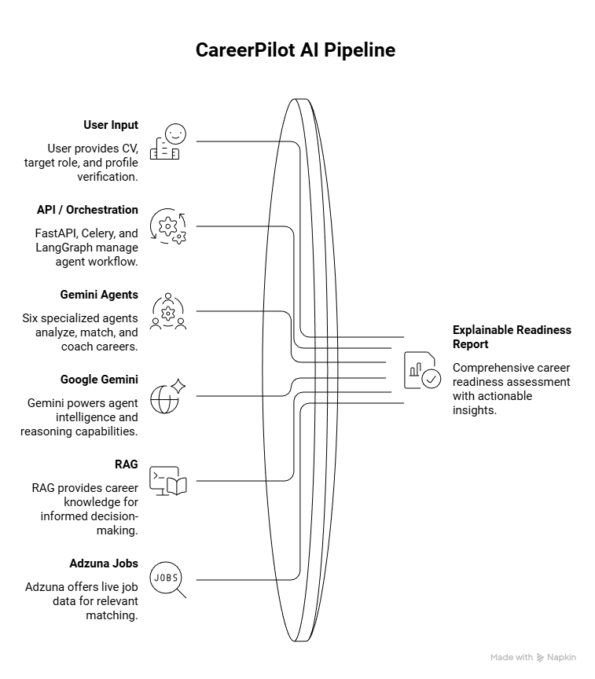
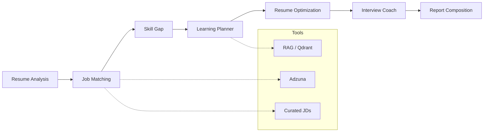

<p align="center">
  
</p>

<h1 align="center">CareerPilot AI</h1>

<p align="center">
  <strong>Multi-agent Career Readiness Operating System</strong><br />
  Turn a real resume into an explainable hiring decision — not a single-prompt chatbot.
</p>

<p align="center">
  
  
  
  
  
  
</p>

<p align="center">
  <a href="#setup">Setup</a> ·
  <a href="#system-architecture">Architecture</a> ·
  <a href="#ai-agent-workflow">Agent workflow</a> ·
  <a href="#core-features">Features</a> ·
  <a href="docs/QUICK_START.md">Quick start</a> ·
  <a href="docs/architecture-event-driven.md">Event-driven docs</a>
</p>

---

## What it does

CareerPilot analyses a CV against a target IT role and produces:

| Output | What you get |
| --- | --- |
| Readiness score | Explainable fit for the role |
| Skill gaps | Impact-ranked gaps with evidence |
| Job matches | Live Adzuna + curated real JDs |
| Hiring sprint | 7-day action plan |
| Interview + resume coaching | Role-targeted drills and tips |
| Mentor + Analytics | Report-grounded chat and progress over time |

---

## System architecture

<p align="center">
  
</p>

<p align="center"><em>User input → FastAPI / Celery / LangGraph → six Gemini agents + RAG + Adzuna → explainable readiness report</em></p>

### Stack at a glance

| Layer | Technology | Role |
| --- | --- | --- |
| Frontend | React · Vite · TypeScript · SCSS | Upload → Analysis workspace |
| API | FastAPI | REST API, auth, uploads, reports |
| Orchestration | LangGraph | Multi-agent pipeline graph |
| Async | Celery (+ thread fallback) | Non-blocking analysis jobs |
| LLM | Google Gemini | Reasoning for all six agents |
| RAG | Qdrant + Gemini embeddings | Career knowledge retrieval |
| Jobs | Adzuna API | Live listings (curated JD fallback) |
| Data | PostgreSQL | Profiles, jobs, reports, knowledge |
| Auth | Email / Google Sign-In + JWT | Candidate ownership |

---

## AI agent workflow

Six specialized Gemini agents run as a **real multi-step pipeline**:



| # | Agent | Responsibility |
| --- | --- | --- |
| 1 | **Resume Analysis** | Structure skills, education, projects, experience |
| 2 | **Job Matching** | Score live Adzuna listings; fall back to curated real JDs |
| 3 | **Skill Gap** | Rank missing competencies by hiring impact |
| 4 | **Learning Planner** | RAG-grounded learning roadmap |
| 5 | **Resume Optimization** | Role-targeted CV edits |
| 6 | **Interview Coach** | Practice prompts aligned to gaps and role |

**Tools:** resume parse/guard · Adzuna search · curated JD query · Gemini embeddings RAG · PDF export  

**Memory:** re-analysis loads prior context; Analytics tracks score and gap trends.

> Agent logic is **real and running** (Gemini + LangGraph). `CAREERPILOT_USE_STUB_LLM=1` is for CI/tests only — keep stub mode **off** for demos.

---

## Core features

```text
Upload & Verify  →  Multi-agent Analyse  →  Analysis Workspace
                                              ├── Overview
                                              ├── Readiness
                                              ├── Skill Gaps
                                              ├── Hiring Sprint
                                              ├── AI Mentor
                                              ├── Reports / PDF
                                              └── Analytics
```

- **Upload & verify** — PDF / DOCX / TXT with resume-vs-document guard  
- **Live agent stages** — named pipeline progress while analysis runs  
- **Live jobs** — Adzuna primary; curated real company JDs as fallback  
- **Auth** — optional Google Sign-In / email with candidate ownership  

---

## Project structure

```text
careerpilot/
├── backend/                 # FastAPI · LangGraph · agents · RAG · Celery
├── frontend/                # React (Vite) Analysis workspace
├── docs/
│   ├── images/              # Logo + architecture diagram
│   ├── QUICK_START.md
│   └── architecture-event-driven.md
└── docker-compose.yml
```

---

## Setup

### Prerequisites

- Python **3.11+** (3.12 OK)
- Node.js **18+**
- PostgreSQL
- [Google AI Studio](https://aistudio.google.com/apikey) API key
- Optional: [Adzuna](https://developer.adzuna.com/) `APP_ID` + `APP_KEY`

### 1) Backend

```powershell
cd backend
python -m venv .venv
.\.venv\Scripts\activate
pip install -r requirements.txt
copy .env.example .env
```

Configure `backend/.env`:

| Variable | Required | Notes |
| --- | --- | --- |
| `DATABASE_URL` / Postgres vars | Yes | Match your local Postgres password |
| `GOOGLE_API_KEY` | Yes | Real Gemini agents |
| `ADZUNA_APP_ID` / `ADZUNA_APP_KEY` | Optional | Live jobs; curated fallback otherwise |
| `ADZUNA_COUNTRY` | Optional | Default `gb` (country code, not “Europe”) |
| `CAREERPILOT_USE_STUB_LLM` | Keep `0` | Tests set stub mode themselves |
| `SSL_VERIFY` | Optional | Set `0` on Windows if cert verify fails |
| `AUTH_DISABLED` | Dev default `1` | Set `0` when auth is configured |

```powershell
python scripts\setup_postgres.py
python scripts\seed_knowledge.py --force
uvicorn app.main:app --reload --host 127.0.0.1 --port 8000
```

| Endpoint | URL |
| --- | --- |
| API | http://127.0.0.1:8000 |
| Swagger | http://127.0.0.1:8000/docs |
| Health | http://127.0.0.1:8000/health → `gemini_configured: true`, `stub_llm: false` |

Optional Celery worker (only if `CELERY_USE_THREAD_FALLBACK=0`):

```powershell
celery -A app.workers.celery_app.celery_app worker --loglevel=INFO --pool=solo
```

### 2) Frontend

```powershell
cd frontend
npm install
copy .env.example .env
```

```env
VITE_API_BASE=http://127.0.0.1:8000
```

```powershell
npm run dev
```

UI → http://127.0.0.1:5173  

Full walkthrough: [docs/QUICK_START.md](docs/QUICK_START.md)

---

## Verify the prototype

1. `/health` → `gemini_configured: true`, `stub_llm: false` (+ `adzuna_configured: true` if keys set)  
2. Upload a real CV → verify profile → **Analyse**  
3. Watch named agent stages complete  
4. Tour Analysis: Overview → Gaps → Hiring Sprint → Mentor → Reports → Analytics  
5. Jobs badge shows `live` / `live+curated` when Adzuna works, else curated fallback  

---

## Tests

```powershell
cd backend
.\.venv\Scripts\python -m pytest -q
```

```powershell
cd frontend
npm run build
```

CI uses SQLite + stub LLM (no live Gemini/Adzuna required for tests).

---

## Third-party services

| Service | Use |
| --- | --- |
| [Google Gemini](https://aistudio.google.com/) | Agent reasoning + embeddings |
| [Adzuna Jobs API](https://developer.adzuna.com/) | Live job listings |
| FastAPI · LangGraph · Celery · React · Qdrant · PostgreSQL | Application stack |

Do **not** commit `backend/.env` (API keys).

---

## Future plans

- Multi-country live job coverage  
- Institutional / mentor dashboards  
- Deeper mentoring evaluation loops  
- Production hardening (deploy, monitoring, auth-by-default)  
- Richer RAG corpus (courses, role playbooks, company patterns)  

---

<p align="center">
  Built for <strong>Idealize 2026 — Open Category</strong><br />
  AIESEC in University of Moratuwa · Real multi-agent reasoning, tools, and multi-step workflows
</p>
